- [Livrables](#livrables)

- [Échéance](#%c3%89ch%c3%a9ance)

- [Quelques éléments à considérer](#quelques-%c3%a9l%c3%a9ments-%c3%a0-consid%c3%a9rer-pour-les-parties-2-et-3)

- [Travail à réaliser](#travail-%c3%a0-r%c3%a9aliser)

# Sécurité des réseaux sans fil

## Laboratoire 802.11 Sécurité WPA Entreprise

__A faire en équipes de deux personnes__

### Objectif :

1.	Analyser les étapes d’une connexion WPA Entreprise avec une capture Wireshark
2.	__(optionnel)__ Implémenter une attaque WPE (Wireless Pwnage Edition) contre un réseau WPA Entreprise
1.  __(optionnel)__ Implémenter une attaque GTC Dowgrade contre un réseau WPA Entreprise


## Quelques éléments à considérer pour les parties 2 et 3 :

Les parties 2 et 3 sont optionnelles puisque vous ne disposez pas forcement du matériel nécessaire pour les réaliser.

En principe, il devrait être possible de démarrer vos machines en Kali natif (à partir d'une clé USB, avec une distro live par exemple) ou d'employer une autre version de Linux. Si vous n'avez pas une interface WiFi USB externe, __vous ne pouvez pas faire ces parties dans une VM Linux__. 

Dans le cas où vous arriverais à tout faire pour démarrer un Linux natif, il existe toujours la possibilité que votre interface WiFi ne puisse pas être configurée en mode AP, ce qui à nouveau empêche le déroulement des parties 2 e 3.

Ces deux parties sont vraiment intéressantes et __je vous encourage à essayer de les faire__, si vous avez les ressources. Malheureusement je ne peux pas vous proposer un bonus si vous les faites, puisqu'il risque d'y avoir des personnes qui n'auront pas la possibilité de les réaliser pour les raisons déjà expliquées.

Si toutes les équipes rendent le labo complet, il sera donc corrigé entièrement et les parties 2 et 3 seront considérées pour la note.

Si vous vous lancez dans ces deux parties, voici quelques informations qui peuvent vous aider :

- Solution à l’erreur éventuelle « ```Could not configure driver mode``` » :

```
nmcli radio wifi off
rfkill unblock wlan
```
-	Pour pouvoir capturer une authentification complète, il faut se déconnecter d’un réseau et attendre 1 minute (timeout pour que l’AP « oublie » le client) 
-	Les échanges d’authentification entreprise peuvent être facilement trouvés utilisant le filtre d’affichage « ```eap``` » dans Wireshark


## Travail à réaliser

### 1. Analyse d’une authentification WPA Entreprise

Dans cette première partie, vous allez analyser [une connexion WPA Entreprise](files/auth.pcap) avec Wireshark et fournir des captures d’écran indiquant dans chaque capture les données demandées.

- Comparer [la capture](files/auth.pcap) au processus d’authentification donné en théorie (n’oubliez pas les captures d'écran pour illustrer vos comparaisons !). En particulier, identifier les étapes suivantes :
```
Source : https://tools.ietf.org/html/rfc3748

Afin de pouvoir correctement analysé la capture, nous avons appliqué un filtre "eapol" afin d'obtenir les adresses MAC des deux appareils concerné par la connexion. Une fois ces deux adresses obtenues nous avons utilisé le filtre suivant:

(((wlan.sa == 30:74:96:70:df:32) && (wlan.da == dc:a5:f4:60:bf:50)) || ((wlan.sa == dc:a5:f4:60:bf:50) && (wlan.da == 30:74:96:70:df:32)))
```
- Requête et réponse d’authentification système ouvert
```
Le paquet 21455 est une demande d'authentification à système ouvert de la part de HuaweiTe_70 à Cisco_60
```

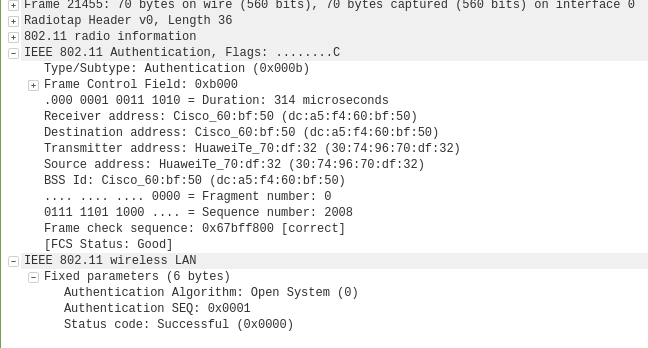

```
Le paquet 21457 est la réponse de Cisco_60 à HuaweiTe_70 indiquant une réussite.
```

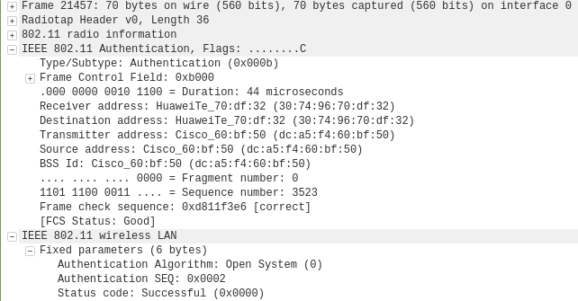

- Requête et réponse d’association (ou reassociation)
```
Le paquet 21460 est une demande de Reassociation de la part de HuaweiTe_70 à Cisco_60.
```

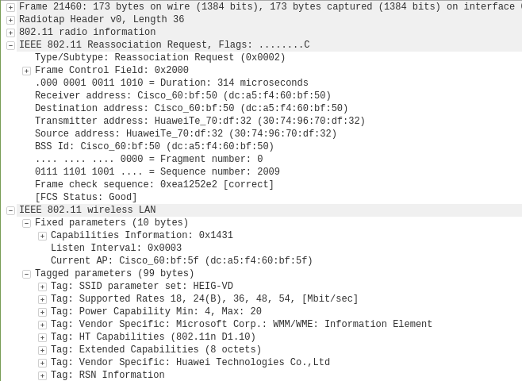
```

Le paquet 21462 est une réponse de Reassociation de la part de Cisco_60 indiquant un succès.
```
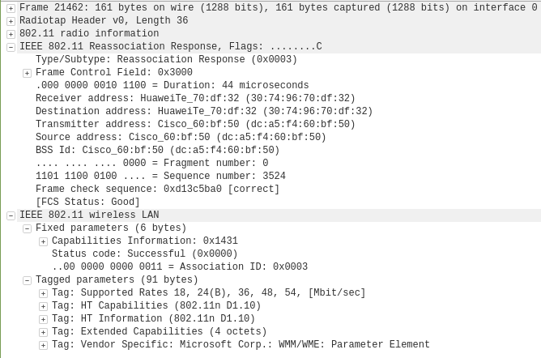

- Négociation de la méthode d’authentification entreprise
```
Le paquet 21471 est une demande deCisco_60 d'utiliser EAP-TLS.
```
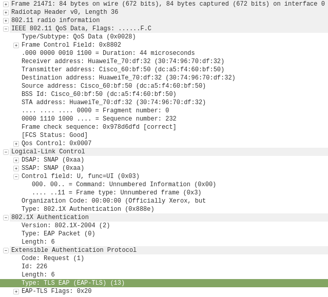
```
Le paquet 21475 est une réponse Legacy Nak servant à indiquer que la demande est refusée et à proposé un type d'authentification souhaité.
```
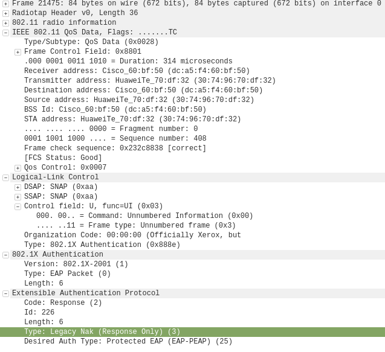
```
Puis le paquet 21477 est à nouveau une requête de protocol pour EAP-PEAP
```
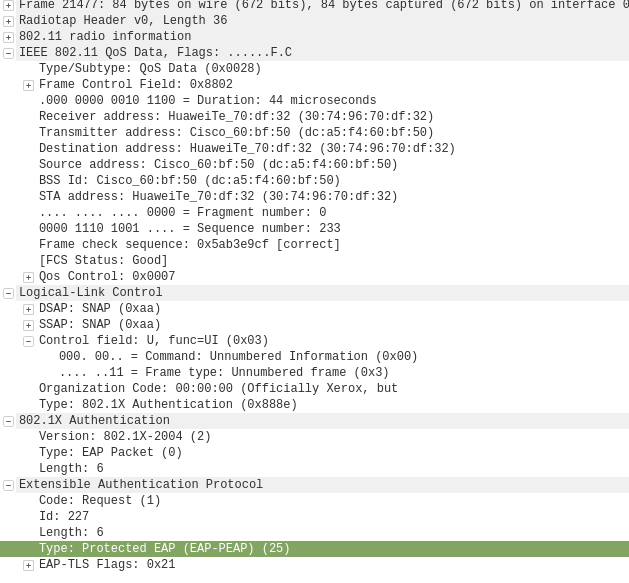

- Phase d’initiation. Arrivez-vous à voir l’identité du client ?
```
Le paquet 21465 est une demande d'identité de la part de Cisco_60 pour HuaweiTe_70.
```
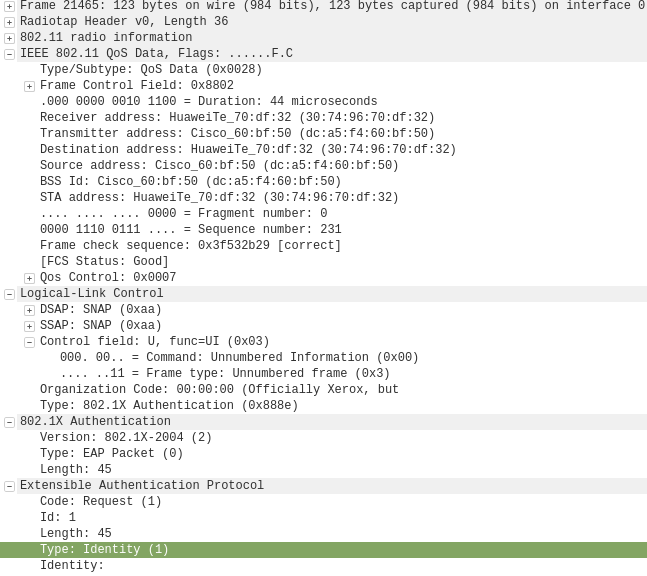
```
Le paquet 21469 est la réponse de la part de HuaweiTe_70. Cette réponse contient l'identité demandée par le point d'accès pour le serveur d'auth.
```
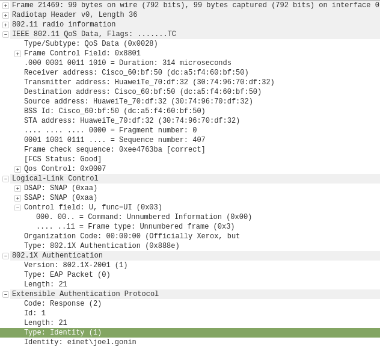
```
Nous arrivons à voir l'identité du client qui est einet\joel.gonin.
```
- Phase hello :
```
Le paquet 21495 est le Client Hello, il contient toutes les informations suivantes
```
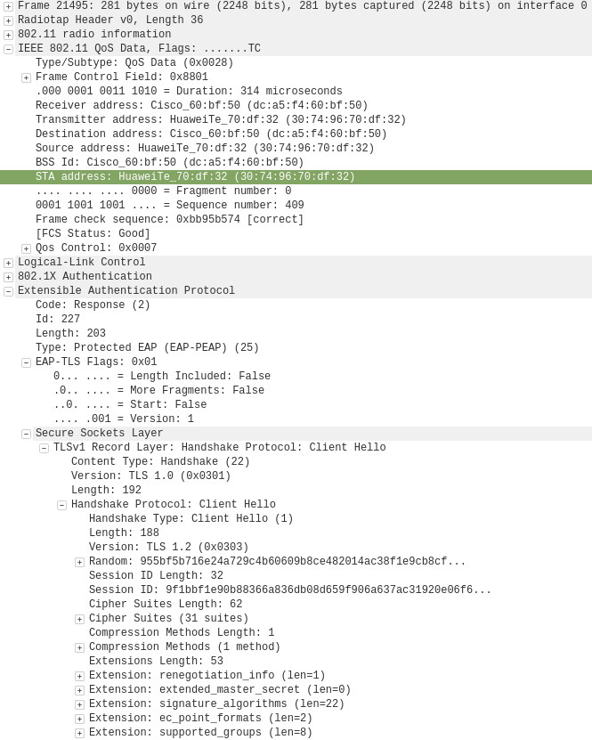

 		Les fragments 21498, 21502, 21508, 21512 et 21517 sont le Serveur Hello, son certificat ainsi que le Serveur Hello Done.

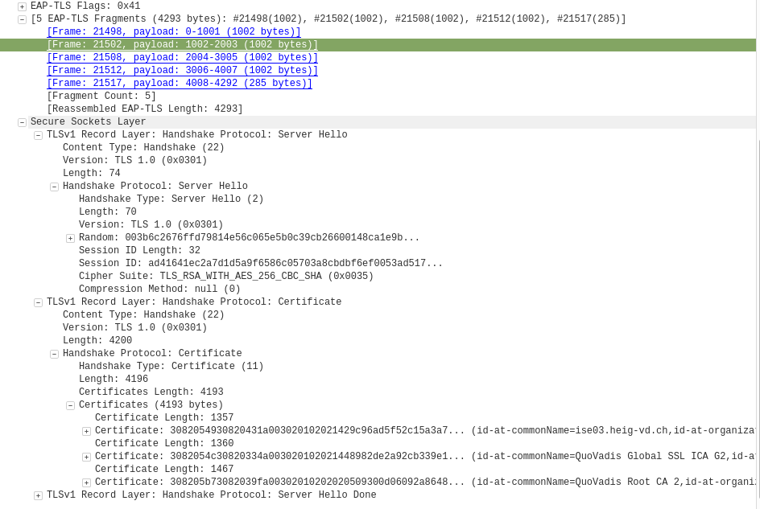

- Version TLS :
```
La version 1.0 est utilisée malgré une demande de version 1.2.
```
- Suites cryptographiques et méthodes de compression proposées par le client et acceptées par l’AP
```
Aucune méthode de compression n'est proposée et donc utilisée. Par contre 31 Ciphersuites sont proposée par le client 
```

```
et c'est TLS_RSA_WITH_AES_256_CBC_SHA qui est sélectionné par le serveur.
```

- Nonces
```
Le nonce du client est 95:5b:f5:b7:16:e2:4a:72:9c:4b:60:60:9b:8c:e4:82:01:4a:c3:8f:1e:9c:b8:cf:2b:f8:fd:30:bf:89:95:f1

et celui du serveur est 00:3b:6c:26:76:ff:d7:98:14:e5:6c:06:5e:5b:0c:39:cb:26:60:01:48:ca:1e:9b:3e:8a:f8:34:26:d4:6e:11
```

- Session ID
```
Celle du client est  9f:1b:bf:1e:90:b8:83:66:a8:36:db:08:d6:59:f9:06:a6:37:ac:31:92:0e:06:f6:22:76:2c:a6:c5:22:a6:4f

Celle du serveur est ad:41:64:1e:c2:a7:d1:d5:a9:f6:58:6c:05:70:3a:8c:bd:bf:6e:f0:05:3a:d5:17:f6:e6:9b:28:68:04:f5:f2
```

- Phase de transmission de certificats
	- Echanges des certificats 
```
Le client n'a pas de certificat lors de l'utilisation de  EAP-PEAP. Les certificats du serveur sont visibles lors du serveur Hello.
``` 
- Change cipher spec
```
Le cipher change spec est le paquet 21524
```
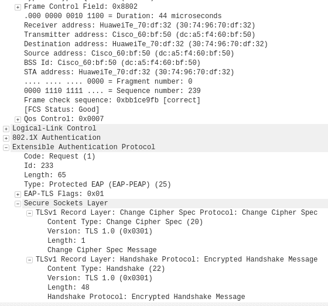

- Authentification interne et transmission de la clé WPA (échange chiffré, vu comme « Application data »)
```
Nous pouvons voir les données chiffrées de l'authentification interne car cela à lieu entre le suppliant et le serveur au travers du wifi. Ces paquets sont visibles sur la capture ci-dessous.
Par contre la transmission des clef WPA est faite entre le serveur et l'AP. Les deux étant dans le DS il n'est pas possible de voir cet échange.
```
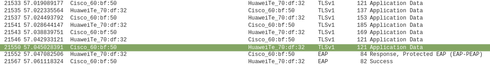

- 4-way handshake
```
Le 4 ways handshake est visible après la réponse Succes de la part de Cisco_60. (Paquet 21567). Il devrait être composé des messages 1,2,3 et 4 mais nous voyons pas de message 2 et un rejeu du message 3. Aucun autre handshake complet entre ces appareils n'est visible.
```
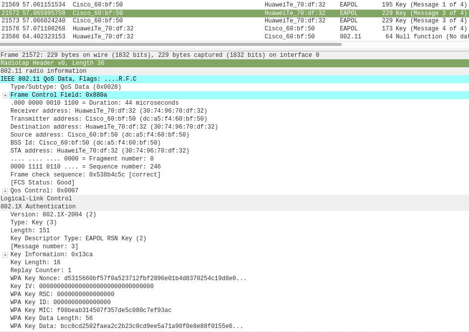

### Répondez aux questions suivantes :
 
> **_Question :_** Quelle ou quelles méthode(s) d’authentification est/sont proposé(s) au client ?
> 
> **_Réponse :_** 
La méthode d'authentification proposée au client est EAP-TLS et ce choix est décliné avec une demande d'utiliser EAP-PEAP. Après cela la méthode EAP-PEAP lui est proposée.
Voir les captures de la partie : Négociation de la méthode d’authentification entreprise
---

> **_Question:_** Quelle méthode d’authentification est finalement utilisée ?
> 
> **_Réponse:_** 
La méthode utilisée est EAP-PEAP. Nous pouvons le voir dans le protocol utilisé lors du Client Hello au paquet 21495.
---

> **_Question:_** Lors de l’échange de certificats entre le serveur d’authentification et le client :
> 
> - a. Le serveur envoie-t-il un certificat au client ? Pourquoi oui ou non ?
> 
> **_Réponse:_**
>  Oui, le serveur envoie son certificat afin que le client puisse le vérifier puis utiliser la clef publique présente pour authentifier le serveur.
> - b. Le client envoie-t-il un certificat au serveur ? Pourquoi oui ou non ?
> 
> **_Réponse:_**
> Non, la méthode d'authentification est du EAP-PEAP qui n'est pas basée sur un certificat mais sur une étape d'authentification interne qui est visible comme étant des applications data.

---

### 2. (__Optionnel__) Attaque WPA Entreprise (hostapd)

Les réseaux utilisant une authentification WPA Entreprise sont considérés aujourd’hui comme étant très surs. En effet, puisque la Master Key utilisée pour la dérivation des clés WPA est générée de manière aléatoire dans le processus d’authentification, les attaques par dictionnaire ou brute-force utilisés sur WPA Personnel ne sont plus applicables. 

Il existe pourtant d’autres moyens pour attaquer les réseaux Entreprise, se basant sur une mauvaise configuration d’un client WiFi. En effet, on peut proposer un « evil twin » à la victime pour l’attirer à se connecter à un faux réseau qui nous permette de capturer le processus d’authentification interne. Une attaque par brute-force peut être faite sur cette capture, beaucoup plus vulnérable d’être craquée qu’une clé WPA à 256 bits, car elle est effectuée sur le compte d’un utilisateur.

Pour faire fonctionner cette attaque, il est impératif que la victime soit configurée pour ignorer les problèmes de certificats ou que l’utilisateur accepte un nouveau certificat lors d’une connexion.

Pour implémenter l’attaque :

- Installer ```hostapd-wpe``` (il existe des versions modifiées qui peuvent peut-être faciliter la tâche... je ne les connais pas. Dans le doute, utiliser la version originale). Lire la documentation du site de l’outil ou d’autres ressources sur Internet pour comprendre son utilisation
- Modifier la configuration de ```hostapd-wpe``` pour proposer un réseau semblable au réseau de l’école ou le réseau de votre préférence, sachant que dans le cas d'une attaque réelle, il faudrait utiliser le vrai SSI du réseau de la cible
- Lancer une capture Wireshark
- Tenter une connexion au réseau (ne pas utiliser vos identifiants réels)
- Utiliser un outil de brute-force (```john```, par exemple) pour attaquer le hash capturé (utiliser un mot de passe assez simple pour minimiser le temps)

### Répondez aux questions suivantes :

> **_Question :_** Quelles modifications sont nécessaires dans la configuration de hostapd-wpe pour cette attaque ?
> 
> **_Réponse :_** 

---

> **_Question:_** Quel type de hash doit-on indiquer à john pour craquer le handshake ?
> 
> **_Réponse:_** 

---

> **_Question:_** Quelles méthodes d’authentification sont supportées par hostapd-wpe ?
> 
> **_Réponse:_**


### 3. (__Optionnel__) GTC Downgrade Attack avec [EAPHammer](https://github.com/s0lst1c3/eaphammer) 

[EAPHammer](https://github.com/s0lst1c3/eaphammer) est un outil de nouvelle génération pour les attaques WPA Entreprise. Il peut en particulier faire une attaque de downgrade GTC, pour tenter de capturer les identifiants du client en clair, ce qui évite le besoin de l'attaque par dictionnaire.

- Installer ```EAPHammer```. Lire la documentation du site de l’outil ou d’autres ressources sur Internet pour comprendre son utilisation
- Modifier la configuration de ```EAPHammer``` pour proposer un réseau semblable au réseau de l’école ou le réseau de votre préférence. Le but est de réaliser une GTC Downgrade Attack.
- Lancer une capture Wireshark
- Tenter une connexion au réseau


### Répondez aux questions suivantes :

> **_Question :_** Expliquez en quelques mots l'attaque GTC Downgrade
> 
> **_Réponse :_** 

---

> **_Question:_** Quelles sont vos conclusions et réflexions par rapport à la méthode hostapd-wpe ?
> 
> **_Réponse:_** 


## Livrables

Un fork du repo original . Puis, un Pull Request contenant :

-	Captures d’écran + commentaires
-	Réponses aux questions

## Échéance

Le 1 juin 2020 à 23h59